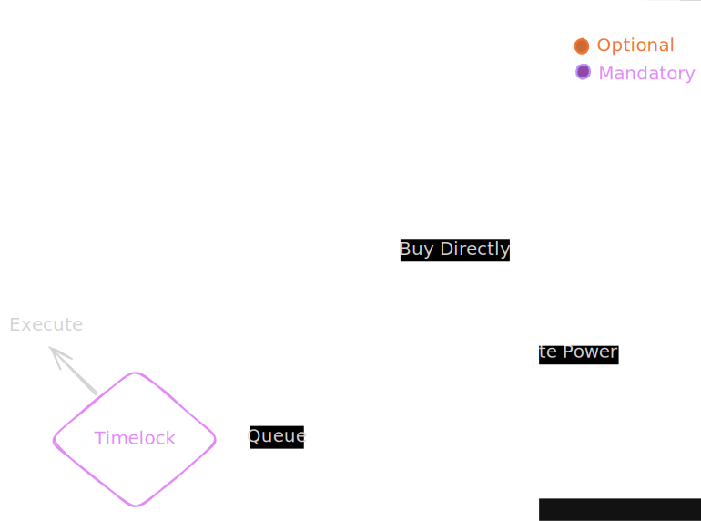

# NFT Stacking Governor

## TODO

- [x] Test ERC-20
- [x] Implement ERC-20
- [x] Test ERC-721
- [x] Implement ERC-721
- [] Test Stacking Contract
- [] Implement Stacking Contract
- [] Test Integration
- [] Integrate ERC-20 with ERC-721 with Stacking
- [] Implement Governance Contract
- [] Deploy

## The Problem It Solves

Essentially, this contract collections and interaction scripts (basically a lib),
creates a asset-weightened governance system where NFTs which grants participation (votes power) on a generic company smart-contract-based election system (whose on practice is the power to execute a contract related to the company itself);
The NFT can be brought by using APEX (APX) Tokens which can also be staked.

The project must be run on a Linux environment.

## Diagram (Contract + General Flow)

The architecture is simple: It uses a DAO governance as queue / audit mechanism for safely contracts execution.

## ERC Patterns Choice

## Security Audiction

Test files were made using the 3 requested tools.

### Slither

### Mythril

### Hardhat Test Resume

Running Mocha tests

  ApexToken ERC20 Logic
    A. Deployment & Basic Setup
      ✔ should have the correct name and symbol (79ms)
      ✔ should have 18 decimals
      ✔ should mint the initial supply to the owner
      ✔ should set the correct owner and USD price
    B. Oracle Pricing (getRequiredETH)
      ✔ should accurately calculate the ETH required based on a mock ETH price
      ✔ should dynamically update the required ETH if oracle price drops
      ✔ should dynamically update the required ETH if oracle price spikes
    C. Token Purchasing (buy)
      ✔ should revert with 'Invalid requested amount' if asking for more tokens than owner has
      ✔ should revert with 'Invalid ETH amount' if buyer sends less ETH than required
      ✔ should successfully transfer tokens when exact ETH is sent
      ✔ should refund excess ETH and emit Refund event when buyer sends more ETH than required
      ✔ should allow a buyer to buy directly from the owner using buy() function even without explicit ERC20 allowance
    D. Safe Transfer (safeTransfer)
      ✔ should successfully transfer tokens without needing approval

  Xtal DAO: Governor & Timelock Integration
    Proposal Lifecycle
      ✔ should successfully propose, vote, queue, and execute a proposal (203ms)
      ✔ should fail a proposal if quorum is not reached

  XtalNFT Logic
    A. Deployment & Basic Setup
      ✔ should have the correct name and symbol (45ms)
      ✔ should set the correct initial owner
      ✔ should set the correct initial mint price
    B. Minting (safeMint)
      ✔ should revert if user has insufficient APX tokens
      ✔ should revert if user has APX but hasn't approved XtalNFT
      ✔ should successfully mint and deduct APX tokens (45ms)
      ✔ should not allow minting more than MAX_SUPPLY
    C. Admin Functions
      ✔ should allow owner to set new mint price
      ✔ should prevent non-owner from setting mint price
    D. Voting/Delegation
      ✔ should update voting power after delegation (41ms)

  25 passing (647ms)

25 passing (25 mocha)

Saved html report to /home/wnccys/Progs/ETH/dao-nft-project/coverage/html
╔════════════════════════════════════════════════════════════════════════════════════════════╗
║                                      Coverage Report                                       ║
╚════════════════════════════════════════════════════════════════════════════════════════════╝
╔════════════════════════════════════════════════════════════════════════════════════════════╗
║ File Coverage                                                                              ║
╟───────────────────────────────────────────────────┬────────┬─────────────┬─────────────────╢
║ File Path                                         │ Line % │ Statement % │ Uncovered Lines ║
╟───────────────────────────────────────────────────┼────────┼─────────────┼─────────────────╢
║ contracts/Xtal-Timelock-Governor/AphexToken.sol   │ 100.00 │ 100.00      │ -               ║
║ contracts/Xtal-Timelock-Governor/XtalGovernor.sol │ 72.73  │ 72.73       │ 69, 74, 97      ║
║ contracts/Xtal-Timelock-Governor/XtalNFT.sol      │ 81.82  │ 81.82       │ 65, 74          ║
╟───────────────────────────────────────────────────┼────────┼─────────────┼─────────────────╢
║ Total                                             │ 86.49  │ 86.84       │                 ║
╚═══════════════════════════════════════════════════╧════════╧═════════════╧═════════════════╝
