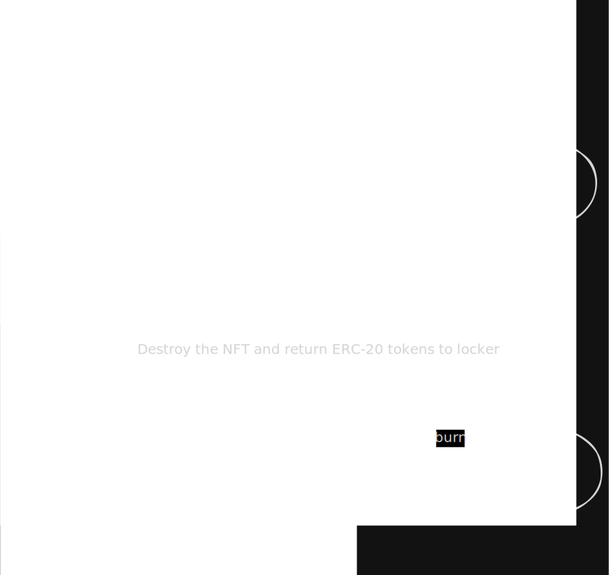

# NFT Stacking Governance

## What is it

Essentially, this contract collections and interaction scripts,
creates a asset-weightened governance system where NFTs grants participation (votes power) on a generic company smart-contract-based election system (whose on practice is the power to execute a contract related to the company itself).

XtalNFT can be brought by using APEX (APX) Tokens which can also be staked.

The project must be run on a Linux environment.

## Diagram (Contract + General Flow)

The architecture is simple: It uses a DAO governance as queue/audit mechanism for safe contracts execution.




## Roadmap

- [x] Test ERC-20
- [x] Implement ERC-20
- [x] Test ERC-721
- [x] Implement ERC-721
- [x] Test Staking Contract
- [x] Implement Staking Contract
- [x] Test Integration
- [x] Integrate ERC-20 and ERC-721 with Staking
- [x] Test Timelock/Governance
- [x] Implement Timelock/Governance Contract
- [x] Deploy

## ERC Patterns Choice

The main reason of the current ERC patterns' choices was the educational purpose they have. As ERC-20 can essentially be broken into smaller pieces it and the ERC-721 integration are pretty useful educational tools when learning about the entire flow of how Governance and Staking works.

## General Workflow

What (and How) is possible to do with this app?

This ecosystem provides a complete decentralized governance solution where voting power is determined by holding NFTs (`XtalNFT`), and those NFTs are acquired using a specific ERC-20 token (`$APX`).

**Core Capabilities:**
1. **Token Acquisition:** Users can purchase `$APX` tokens using ETH. The contract uses a Chainlink Oracle price feed to dynamically calculate the required ETH to match a pegged USD price, ensuring fair entry regardless of ETH market volatility.
2. **NFT Minting:** Users can spend their `$APX` tokens to mint a `XtalNFT`. The NFTs grant the holder voting power within the DAO.
3. **Staking for Voting Multipliers:** Users who want to increase their influence can lock their `$APX` tokens in the `AphexStake` contract for a fixed duration (e.g., 15 days). In return, they receive a multiplier on their voting power (e.g., 2 NFTs instead of 1 for the same amount of APX). When the lock expires, they can burn the NFTs to retrieve their original APX.
4. **Decentralized Governance:** NFT holders can delegate their votes, create proposals, and cast votes on active proposals using the `XtalGovernor` contract.
5. **Secure Execution:** If a proposal passes, it enters the `TimelockController`. After a mandatory delay period, the proposal is executed automatically by the blockchain, altering the state of the integrated contracts (for example, changing the minting price of the NFTs) without any central administrative intervention.

**Interactive Demonstration:**
The deployment script (`scripts/NFT-Timelock-Governor/deploy.ts`) is designed to be a complete, executable demonstration of this entire lifecycle. Running the script will automatically deploy the contracts, grant the correct permissions, simulate a user buying tokens, staking them, delegating votes, creating a proposal, passing time, voting, and finally executing the proposal through the Timelock.

1. **Deployment:** Deploys `AphexToken` (ERC-20), `XtalNFT` (ERC-721), `AphexStake` (Staking), `TimelockController`, and `XtalGovernor`.
2. **Access Control:** Grants the Governor proposal rights and sets the Timelock as the executor and sole owner of the NFT contract, relinquishing deployer admin rights to make the DAO fully sovereign.
3. **Purchasing & Minting:** Simulates a user buying APX tokens and using them to safely mint `XtalNFTs` at a USD-pegged price via Chainlink Oracles.
4. **Staking:** Demonstrates locking APX tokens in the `AphexStake` contract to receive bonus (2x) XtalNFTs, increasing voting power.
5. **Governance:** Shows the user delegating their NFT votes, proposing a change to the NFT mint price, and casting votes.
6. **Execution:** Advances time to simulate the voting period ending, reaching quorum, queuing the proposal in the Timelock, advancing the required delay, and finally executing the proposal to alter the `XtalNFT` contract state.

## Project Structure

```text
dao-nft-project/
├── contracts/
│   ├── mocks/                   # Mock contracts for local testing (e.g., Chainlink PriceFeed)
│   └── Xtal-Timelock-Governor/  # Core ecosystem contracts
│       ├── AphexToken.sol       # ERC-20 Native Token ($APX)
│       ├── AphexStake.sol       # Staking contract for $APX -> XtalNFT rewards
│       ├── XtalNFT.sol          # ERC-721 Governance NFT
│       ├── TimelockController.sol # OpenZeppelin Timelock
│       └── XtalGovernor.sol     # OpenZeppelin DAO Governor
├── scripts/
│   └── NFT-Timelock-Governor/
│       └── deploy.ts            # Complete end-to-end local deployment and simulation script
├── test/                        # Mocha/Chai test suites for all contracts
├── ignition/                    # Hardhat Ignition deployment modules
├── types/                       # TypeChain generated TypeScript bindings
└── hardhat.config.ts            # Hardhat configuration and network settings
```

## NPM Scripts

The project includes several predefined scripts in `package.json` to simplify the development and testing workflow:

- `npm run compile`: Compiles the smart contracts using Hardhat.
- `npm run build`: Equivalent to compiling the smart contracts, generates the artifacts and TypeChain types.
- `npm run slither`: Runs the Slither static analysis tool. It automatically handles Hardhat v3 artifact formatting using a custom Python script (`fix-artifacts.py`) before running Slither with dependencies excluded.
- `npm run myth`: Runs the Mythril security analysis tool against the core smart contracts using the provided bash script.
- `npm run script -- <path>`: Executes a specific Hardhat script (e.g., `npm run script -- scripts/NFT-Timelock-Governor/deploy.ts`).
- `npm run clear`: Cleans the Hardhat cache and deletes compiled artifacts.
- `npm run deploy`: Deploys the project modules using Hardhat Ignition to the `localhost` network.
- `npm run fork`: Spins up a local Anvil node by forking the Ethereum Sepolia testnet via an Alchemy RPC URL, allowing you to test against live mainnet/testnet state locally.
- `npm run test`: Runs the complete Mocha/Chai test suite against the smart contracts.

## Security Audiction

Test files were made using the 3 requested tools.

### Slither

All warns shown here are miscellaneous, no real security breach has been found.

```txt
INFO:Detectors:
Detector: unused-return
AphexToken.getRequiredETH() (contracts/Xtal-Timelock-Governor/AphexToken.sol#31-36) ignores return value by (None,price,None,None,None) = priceFeed.latestRoundData() (contracts/Xtal-Timelock-Governor/AphexToken.sol#32)
Reference: https://github.com/crytic/slither/wiki/Detector-Documentation#unused-return
INFO:Detectors:
Detector: shadowing-local
XtalGovernor.constructor(IVotes,TimelockController,uint48,uint32)._token (contracts/Xtal-Timelock-Governor/XtalGovernor.sol#27) shadows:
        - GovernorVotes._token (node_modules/@openzeppelin/contracts/governance/extensions/GovernorVotes.sol#16) (state variable)
XtalGovernor.constructor(IVotes,TimelockController,uint48,uint32)._timelock (contracts/Xtal-Timelock-Governor/XtalGovernor.sol#28) shadows:
        - GovernorTimelockControl._timelock (node_modules/@openzeppelin/contracts/governance/extensions/GovernorTimelockControl.sol#25) (state variable)
Reference: https://github.com/crytic/slither/wiki/Detector-Documentation#local-variable-shadowing
INFO:Detectors:
Detector: pragma
7 different versions of Solidity are used:
        - Version constraint ^0.8.0 is used by:
                -^0.8.0 (node_modules/@chainlink/contracts/src/v0.8/shared/interfaces/AggregatorInterface.sol#2)
        [...]
Reference: https://github.com/crytic/slither/wiki/Detector-Documentation#different-pragma-directives-are-used
INFO:Detectors:
Detector: dead-code
XtalNFT._increaseBalance(address,uint128) (contracts/Xtal-Timelock-Governor/XtalNFT.sol#71-73) is never used and should be removed
Reference: https://github.com/crytic/slither/wiki/Detector-Documentation#dead-code
INFO:Detectors:
Detector: low-level-calls
Low level call in AphexToken.buy(uint256) (contracts/Xtal-Timelock-Governor/AphexToken.sol#41-54):
        - (success,None) = address(msg.sender).call{value: refund}() (contracts/Xtal-Timelock-Governor/AphexToken.sol#50)
Reference: https://github.com/crytic/slither/wiki/Detector-Documentation#low-level-calls
INFO:Slither:. analyzed (67 contracts with 101 detectors), 6 result(s) found

```

### Mythril

Mythril tests are huge, so they can be seen by running:
```sh
npm run myth
```

### Hardhat Test Resume

```txt
Running Mocha tests


  AphexStake
    ✔ should allow a user to lock tokens and receive 2 NFTs (170ms)
    ✔ should allow unlock and burn after duration (50ms)
    ✔ should fail to unlock before duration (46ms)

  ApexToken ERC20 Logic
    A. Deployment & Basic Setup
      ✔ should have the correct name and symbol
      ✔ should have 18 decimals
      ✔ should mint the initial supply to the owner
      ✔ should set the correct owner and USD price
    B. Oracle Pricing (getRequiredETH)
      ✔ should accurately calculate the ETH required based on a mock ETH price
      ✔ should dynamically update the required ETH if oracle price drops
      ✔ should dynamically update the required ETH if oracle price spikes
    C. Token Purchasing (buy)
      ✔ should revert with 'Invalid requested amount' if asking for more tokens than owner has
      ✔ should revert with 'Invalid ETH amount' if buyer sends less ETH than required
      ✔ should successfully transfer tokens when exact ETH is sent
      ✔ should refund excess ETH and emit Refund event when buyer sends more ETH than required
      ✔ should allow a buyer to buy directly from the owner using buy() function even without explicit ERC20 allowance
    D. Safe Transfer (safeTransfer)
      ✔ should successfully transfer tokens without needing approval

  Xtal DAO: Governor & Timelock Integration
    Proposal Lifecycle
      ✔ should successfully propose, vote, queue, and execute a proposal (177ms)
      ✔ should fail a proposal if quorum is not reached

  XtalNFT Logic
    A. Deployment & Basic Setup
      ✔ should have the correct name and symbol (49ms)
      ✔ should set the correct initial owner
      ✔ should set the correct initial mint price
    B. Minting (safeMint)
      ✔ should revert if user has insufficient APX tokens
      ✔ should revert if user has APX but hasn't approved XtalNFT
      ✔ should successfully mint and deduct APX tokens (42ms)
      ✔ should not allow minting more than MAX_SUPPLY
    C. Admin Functions
      ✔ should allow owner to set new mint price
      ✔ should prevent non-owner from setting mint price
    D. Voting/Delegation
      ✔ should update voting power after delegation (39ms)


  28 passing (791ms)


28 passing (28 mocha)

Saved html report to /home/wnccys/Progs/ETH/dao-nft-project/coverage/html
╔════════════════════════════════════════════════════════════════════════════════════════════╗
║                                      Coverage Report                                       ║
╚════════════════════════════════════════════════════════════════════════════════════════════╝
╔════════════════════════════════════════════════════════════════════════════════════════════╗
║ File Coverage                                                                              ║
╟───────────────────────────────────────────────────┬────────┬─────────────┬─────────────────╢
║ File Path                                         │ Line % │ Statement % │ Uncovered Lines ║
╟───────────────────────────────────────────────────┼────────┼─────────────┼─────────────────╢
║ contracts/Xtal-Timelock-Governor/AphexToken.sol   │ 100.00 │ 100.00      │ -               ║
║ contracts/Xtal-Timelock-Governor/AphexStake.sol   │ 100.00 │ 100.00      │ -               ║
║ contracts/Xtal-Timelock-Governor/XtalGovernor.sol │ 72.73  │ 72.73       │ 69, 74, 97      ║
║ contracts/Xtal-Timelock-Governor/XtalNFT.sol      │ 95.35  │ 92.00       │ 110, 119        ║
╟───────────────────────────────────────────────────┼────────┼─────────────┼─────────────────╢
║ Total                                             │ 94.62  │ 93.42       │                 ║
╚═══════════════════════════════════════════════════╧════════╧═════════════╧═════════════════╝
```

## Deploy

The deploys were made on the Sepolia Testnet with the file in scripts/deploy-sepolia.ts.
A valid private key must be set on hardhat.config.ts in networks if a new deploy is desired. (Balance will be used).

- **XtalNFT:** `0x52435Fa332FdACC481B9169a8A6051808Fa216a1`
- **AphexToken:** `0xeD0AEDB0627734633b80E88F1aafbbb67B5c1c30`
- **AphexStake:** `0x78148149A8A913a8A022765c75D0cEF1Cc0466AF`
- **TimelockController:** `0x6619e8fc7A479de882A310f720Ed4DC91633b1A2`
- **XtalGovernor:** `0x074C1b4232741861A17b483529fC52772b8203d3`

These changes has been made in order to proper configure the environment (all of them present on the deploy-sepolia.ts file):

* Setting AphexStake as an authorized minter in XtalNFT...

* Granting PROPOSER_ROLE to Governor...

* Granting EXECUTOR_ROLE to zero address (anyone can execute)...

* Transferring XtalNFT ownership to the TimelockController...

* Renouncing Timelock admin role from the deployer...